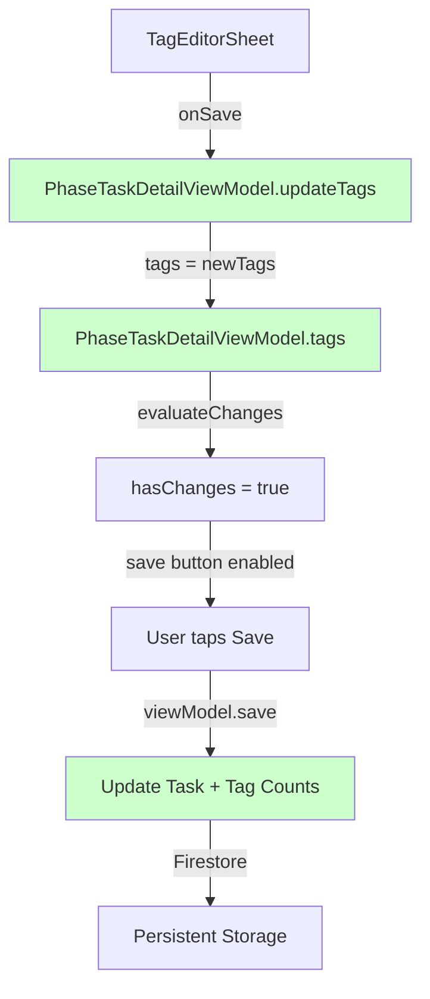
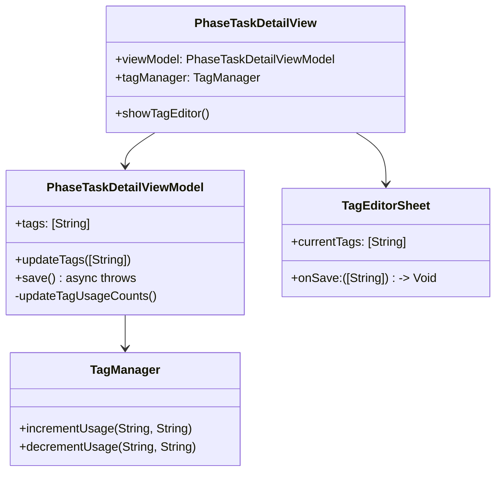

# Tag Save Flow Design Specification

**Created**: 2025年1月4日  
**Issue**: PhaseTaskDetailView タグ保存機能が動作しない  
**Priority**: 🚨 Critical

## 🔍 Root Cause Analysis

### Current Architecture Problem

```swift
// ❌ 現在の問題：タグ状態が分離されている
PhaseTaskDetailView {
    @State private var selectedTags: [String] = []  // ローカル状態
    @StateObject private var viewModel: PhaseTaskDetailViewModel  // タスク状態
}

// PhaseTaskDetailViewModel.save() には tags プロパティがない
class PhaseTaskDetailViewModel {
    @Published var title: String            // ✅ 保存される
    @Published var taskDescription: String  // ✅ 保存される  
    @Published var priority: TaskPriority   // ✅ 保存される
    // ❌ tags プロパティが存在しない
}
```

### Data Flow Issue

```mermaid
graph TD
    A[TagEditorSheet] -->|onSave| B[PhaseTaskDetailView.selectedTags]
    B -.->|❌ 未接続| C[PhaseTaskDetailViewModel]  
    C -->|save()| D[Firestore]
    
    style B fill:#ffcccc
    style C fill:#ffcccc
```

## 🎯 Design Solution

### 1. ViewModel Integration Strategy

```swift
// ✅ 解決案：ViewModelにタグ管理を統合
@MainActor
class PhaseTaskDetailViewModel: ObservableObject {
    // 既存プロパティ
    @Published var title: String
    @Published var taskDescription: String
    @Published var priority: TaskPriority
    
    // 🆕 新規追加：タグ管理
    @Published var tags: [String] {
        didSet { evaluateChanges() }
    }
    
    // オリジナル値の保持
    private let originalTags: [String]
    
    // 🆕 タグ操作メソッド
    func updateTags(_ newTags: [String]) {
        tags = newTags
    }
    
    // 🆕 save()メソッドの拡張
    func save() async throws {
        var updatedTask = originalTask
        // 既存フィールド更新
        updatedTask.title = title
        updatedTask.description = taskDescription
        updatedTask.priority = priority
        
        // 🆕 タグ更新
        updatedTask.tags = tags
        
        // タグ使用回数の自動更新
        if tags != originalTags {
            await updateTagUsageCounts(oldTags: originalTags, newTags: tags)
        }
        
        // Firestore保存
        try await taskManager.updateTask(updatedTask)
    }
}
```

### 2. View Integration Pattern

```swift
// ✅ PhaseTaskDetailView の修正
struct PhaseTaskDetailView: View {
    @StateObject private var viewModel: PhaseTaskDetailViewModel
    // ❌ 削除：@State private var selectedTags
    
    var body: some View {
        // タグ表示：ViewModelから取得
        TaskDetailTagsView(
            task: task,
            tagMasters: tagManager.tags,
            currentTags: viewModel.tags,  // 🆕 ViewModelから取得
            onTagTapped: { tagName in
                // タグタップ処理
            }
        )
        
        // タグ編集Sheet
        .sheet(isPresented: $showingTagEditor) {
            TagEditorSheet(
                currentTags: viewModel.tags,  // 🆕 ViewModelから取得
                availableTags: availableTags,
                familyId: familyId,
                createdBy: task.createdBy,
                onSave: { updatedTags in
                    viewModel.updateTags(updatedTags)  // 🆕 ViewModelに更新
                    // ❌ 削除：selectedTags = updatedTags
                }
            )
        }
    }
}
```

### 3. Tag Usage Count Integration

```swift
// 🆕 TagManager拡張
extension PhaseTaskDetailViewModel {
    private func updateTagUsageCounts(oldTags: [String], newTags: [String]) async {
        let familyId = project.ownerType == .family ? project.ownerId : "unknown"
        
        // 削除されたタグの使用回数を減らす
        let removedTags = Set(oldTags).subtracting(Set(newTags))
        for tagName in removedTags {
            await TagManager.shared.decrementUsage(for: tagName, familyId: familyId)
        }
        
        // 追加されたタグの使用回数を増やす
        let addedTags = Set(newTags).subtracting(Set(oldTags))
        for tagName in addedTags {
            await TagManager.shared.incrementUsage(for: tagName, familyId: familyId)
        }
    }
}
```

## 🏗️ Implementation Architecture

### Data Flow (Fixed)



### Component Integration



## 📋 Implementation Checklist

### Phase 1: ViewModel Enhancement
- [ ] Add `@Published var tags: [String]` to PhaseTaskDetailViewModel
- [ ] Add `private let originalTags: [String]` for comparison
- [ ] Implement `func updateTags(_ newTags: [String])`
- [ ] Update `evaluateChanges()` to include tags comparison
- [ ] Update `save()` method to handle tags

### Phase 2: View Integration  
- [ ] Remove `@State private var selectedTags` from PhaseTaskDetailView
- [ ] Update TagEditorSheet to use `viewModel.tags`
- [ ] Update onSave callback to call `viewModel.updateTags()`
- [ ] Update TagDisplayView to use `viewModel.tags`

### Phase 3: Tag Usage Count
- [ ] Implement `updateTagUsageCounts()` method
- [ ] Add TagManager static/shared instance if needed
- [ ] Test tag count increment/decrement logic

### Phase 4: Testing & Validation
- [ ] Unit tests for ViewModel tag management
- [ ] Integration tests for save functionality
- [ ] UI tests for tag editing flow
- [ ] Manual testing of tag persistence

## 🧪 Testing Strategy

### Test Cases
1. **Tag Addition**: Add new tags → Save → Verify persistence
2. **Tag Removal**: Remove existing tags → Save → Verify removal  
3. **Tag Modification**: Change tag selection → Save → Verify changes
4. **Usage Count**: Verify tag usage counts update correctly
5. **Error Handling**: Test save failures, network issues
6. **Edge Cases**: Empty tags, duplicate tags, long tag names

### Validation Points
- [ ] Tags persist after app restart
- [ ] Tag usage counts are accurate
- [ ] Save button states update correctly
- [ ] Error handling works properly
- [ ] UI feedback is appropriate

## ⚡ Performance Considerations

### Optimization Points
1. **Debounced Tag Updates**: Prevent excessive evaluateChanges() calls
2. **Batch Tag Count Updates**: Combine increment/decrement operations  
3. **Firestore Transaction**: Ensure atomic task+count updates
4. **Memory Management**: Proper cleanup of tag listeners

### Implementation Notes
```swift
// 🆕 Debounced tag updates
private var tagUpdateTask: Task<Void, Never>?

func updateTags(_ newTags: [String]) {
    tagUpdateTask?.cancel()
    tagUpdateTask = Task { @MainActor in
        try? await Task.sleep(nanoseconds: 300_000_000) // 300ms debounce
        guard !Task.isCancelled else { return }
        self.tags = newTags
    }
}
```

## 🚨 Risk Assessment

### Critical Risks
1. **Data Loss**: Tags not saving properly → **Mitigation**: Comprehensive testing
2. **Usage Count Drift**: Incorrect tag statistics → **Mitigation**: Transaction-based updates
3. **UI State Inconsistency**: View/ViewModel desync → **Mitigation**: Single source of truth

### Rollback Plan
If implementation fails:
1. Revert to current working state
2. Implement simpler local-only tag storage
3. Add proper persistence in next iteration

---

**Next Steps**: Proceed with Phase 1 implementation - ViewModel enhancement.