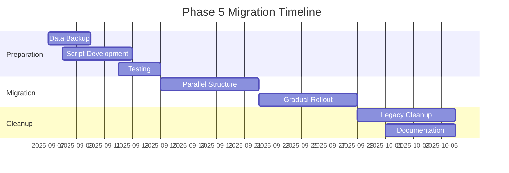

# Firebase Phase5 データ移行計画

シゴデキプロジェクトのデータ構造移行に関する包括的な技術仕様書です。

## 🔗 関連情報

- 🏗️ [Firebase設計](./overview.md) - 全体アーキテクチャ
- 🛠️ [移行ガイド](../../guides/database/migration-procedures.md) - 実装手順
- 📖 [環境構築](../../tutorials/getting-started/firebase-setup.md) - 初期セットアップ

---

# Phase 5: Data Migration Overview
*Shigodeki Architecture Evolution - Session 5.1*

## Migration Overview

This document provides a high-level overview of the data migration strategy from the current family-based structure to the new project-based hierarchy.

---

## Migration Goals

### Primary Objectives
1. **Zero Data Loss**: All existing user data must be preserved
2. **Zero Downtime**: Users continue using the app during migration
3. **Seamless Transition**: Users experience minimal disruption
4. **Rollback Capability**: Ability to revert if issues arise

### Success Criteria
- 100% data migration success rate
- All user relationships preserved
- Task completion history maintained
- No service interruption

---

## Current vs Target Architecture

### Current Structure (Family-Based)
```
families/{familyId}/
├── members/{userId}
├── taskLists/{listId}/
│   ├── metadata
│   └── tasks/{taskId}
└── settings
```

### Target Structure (Project-Based)
```
projects/{projectId}/
├── metadata
├── members/{userId}
├── phases/{phaseId}/
│   ├── metadata
│   └── taskLists/{listId}/
│       └── tasks/{taskId}
└── settings
```

---

## Migration Strategy

### Phase 1: Preparation (Week 1)
1. **Data Backup**: Complete backup of all family data
2. **Migration Scripts**: Development and testing of migration logic
3. **Validation Tools**: Create data integrity verification tools
4. **Rollback Procedures**: Establish emergency rollback processes

### Phase 2: Parallel Structure (Week 2-3)
1. **Shadow Collections**: Create new project structure alongside existing
2. **Dual Write**: Write operations to both old and new structures
3. **Data Synchronization**: Ensure consistency between structures
4. **Client Compatibility**: Update app to read from both structures

### Phase 3: Traffic Switch (Week 4)
1. **Gradual Migration**: Move users in batches (10% -> 50% -> 100%)
2. **Performance Monitoring**: Track response times and error rates
3. **User Feedback**: Monitor user experience and issues
4. **Quick Rollback**: Immediate rollback capability if issues arise

### Phase 4: Cleanup (Week 5-6)
1. **Legacy Data Archive**: Preserve old structure for audit purposes
2. **Code Cleanup**: Remove dual-structure support code
3. **Performance Optimization**: Optimize new structure queries
4. **Documentation Update**: Update all technical documentation

---

## Data Mapping Strategy

### Family to Project Conversion
```javascript
// Migration Logic
const migrateFamily = async (familyId) => {
  const family = await getFamilyData(familyId);
  
  const project = {
    id: generateProjectId(),
    name: family.name || "Family Project",
    type: "family",
    created: family.createdAt,
    migrated: true,
    legacy_family_id: familyId
  };
  
  return project;
};
```

### Task List Restructuring
```javascript
// Task List Migration
const migrateTaskLists = async (familyId, projectId) => {
  const taskLists = await getTaskLists(familyId);
  
  for (const list of taskLists) {
    // Create default phase if none exists
    const phaseId = await ensureDefaultPhase(projectId);
    
    // Move task list to new structure
    await moveTaskList(list, projectId, phaseId);
  }
};
```

### Member Relationship Preservation
```javascript
// Member Role Migration
const migrateMemberRoles = async (familyId, projectId) => {
  const members = await getFamilyMembers(familyId);
  
  const memberMigration = members.map(member => ({
    userId: member.id,
    role: member.isOwner ? 'admin' : 'member',
    joinedAt: member.joinedAt,
    migrated_from: familyId
  }));
  
  return memberMigration;
};
```

---

## Risk Assessment & Mitigation

### High Risk Factors
| Risk | Probability | Impact | Mitigation |
|------|-------------|---------|------------|
| Data corruption during migration | Low | Critical | Complete backup + validation |
| Performance degradation | Medium | High | Gradual rollout + monitoring |
| User experience disruption | Medium | Medium | Clear communication + support |
| Migration script failure | Low | Critical | Extensive testing + rollback |

### Contingency Plans
1. **Immediate Rollback**: Switch traffic back to old structure within 15 minutes
2. **Partial Recovery**: Restore individual user data from backup
3. **Emergency Communication**: Notify users of any service disruption
4. **Support Escalation**: Dedicated support team during migration window

---

## Validation & Testing

### Pre-Migration Validation
- [ ] Data integrity verification scripts
- [ ] Performance benchmark establishment  
- [ ] Migration script unit tests
- [ ] End-to-end migration simulation

### During Migration Monitoring
- [ ] Real-time data consistency checks
- [ ] Performance metric monitoring
- [ ] Error rate tracking
- [ ] User feedback collection

### Post-Migration Verification
- [ ] Complete data audit (100% validation)
- [ ] Performance comparison analysis
- [ ] User experience assessment
- [ ] Legacy system decommissioning verification

---

## Success Metrics

### Technical KPIs
- **Data Migration Success Rate**: 100%
- **Performance Impact**: Less than 5% degradation during migration
- **Error Rate**: Less than 0.1% during transition period
- **Recovery Time**: Under 15 minutes if rollback needed

### User Experience KPIs
- **User Satisfaction**: Above 4.5/5.0 post-migration survey
- **Support Tickets**: Under 10 migration-related tickets
- **App Usage**: No significant drop in daily active users
- **Feature Adoption**: Smooth transition to new project features

---

## Timeline & Milestones



### Key Milestones
- **2025-09-07**: Migration preparation begins
- **2025-09-15**: Parallel structure deployment
- **2025-09-22**: User migration starts (10% batch)
- **2025-09-25**: Full migration completion (100%)
- **2025-10-06**: Legacy system decommission

---

## Communication Plan

### User Communication
1. **Advance Notice**: 2 weeks before migration start
2. **Progress Updates**: Daily status during migration window
3. **Completion Notification**: Confirmation of successful migration
4. **Support Availability**: Extended support hours during transition

### Stakeholder Updates
- **Daily Standups**: Technical team sync during migration week
- **Executive Briefings**: Bi-daily updates to leadership
- **Post-Mortem**: Comprehensive review within 1 week of completion

---

*Document Status*: Phase 5.1 Complete  
*Next Review*: 2025-09-07  
*Owner*: シゴデキ Architecture Team  
*Related Issues*: [Migration Planning #67](https://github.com/company/shigodeki/issues/67)